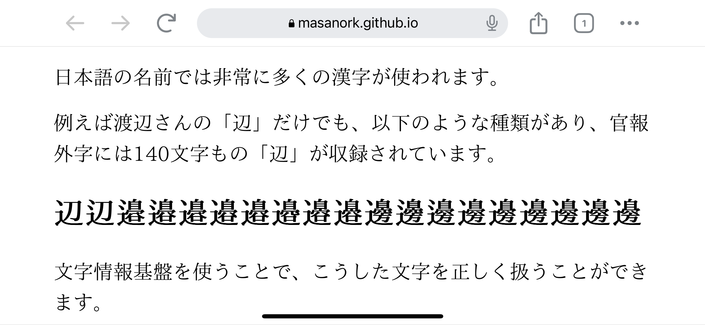

mjm.woff2: IPAmj明朝 WOFF2圧縮フォント
===

IPAmj明朝は文字情報基盤整備事業により整備された、人名漢字等約6万文字の漢字を含む明朝体のフォントです。詳細は[文字情報基盤整備事業](https://moji.or.jp/ipafont/)をご覧ください。mjm.woff2は、IPAフォントのIPAmj明朝をwoff2圧縮したものです。WOFF2圧縮形式とすることにより、フォントファイルのサイズを小さくすることができる他、フォントをインストールできないスマートフォンやタブレット、テレビなどの端末でも氏名の正確な文字を表示できることが期待されます。

例えば[テストページ](Test.html)のように、渡辺の「辺」を正しく表示できるようになります。

woff2圧縮について
---

Web Open Font Format (WOFF)は、ウェブページで使用するためのフォント形式です。WOFF2は、WOFFの改良版で圧縮率が高くなっています。詳細は、[Web Open Font Format (WOFF) 1.0](https://www.w3.org/TR/WOFF/)と[Web Open Font Format 2.0](https://www.w3.org/TR/WOFF2/)をご覧ください。
woff2圧縮は、[Google Fonts](https://fonts.google.com/)の[woff2](https://github.com/google/woff2)を利用して行いました。

ライセンス
 ---

再配布などの条件は「IPAフォントライセンス」に準じます。詳細の条件については、[IPAフォントライセンスv1.0](https://moji.or.jp/ipafont/license/)をご覧ください。
